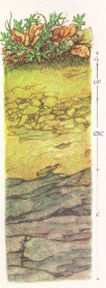

# soilprofile2 

[](http://www.gnu.org/licenses/gpl-3.0)

A package for R that provides the graphical representation of [soil horizons](https://en.wikipedia.org/wiki/Soil_horizon), in the simplest case the color. The focus is on morphological properties such as horizon transitions, texture, structure, root density, and rock content. Soil-forming processes can also be represented with uniform symbols, for example different hydromorphic soils characteristics. Some designations are based on the [German soil mapping instructions](https://de.wikipedia.org/wiki/Bodenkundliche_Kartieranleitung). The package was written as part of my master thesis at the [Chair of Soil Ecology](http://www.bodenkunde.uni-freiburg.de/index_html-en?set_language=en) of the University of Freiburg.  


## Installation
The package is currently only available on Github 
```{r installation, eval = FALSE}
install the development version from github with
install.packages("devtools")
devtools::install_github("nardusstricta/soilprofile2")
```

## Usage
This package provides functions to graphically represent 
soil properties. Morphological data gathered in the field 
such as horizon boundaries, root abundance and dimensions,
skeletal shape, abundance and dimension as well as	
meaningful soil color may be represented via the plot
function.

```{r smooth-lines, dpi = 144}
#Creat same example data:
library(dplyr)
library(soilprofile2)
library(ggplot2)

geom_example <- data.frame(name = c(1, 2),
                           from1 = c(0,20),
                           to1 = c(20, 40)
) %>%
  cord_setting(plot_width = 3)

attri_example <- data.frame(name = c(1, 2),
                            rgb_col = c("#6F5F4CFF", "#947650FF"),
                            nameC = c("Ah", "Bv")
)
```


## Contributing

To contribute to the development of this project please refer to the [guidelines](CONTRIBUTING.md).


